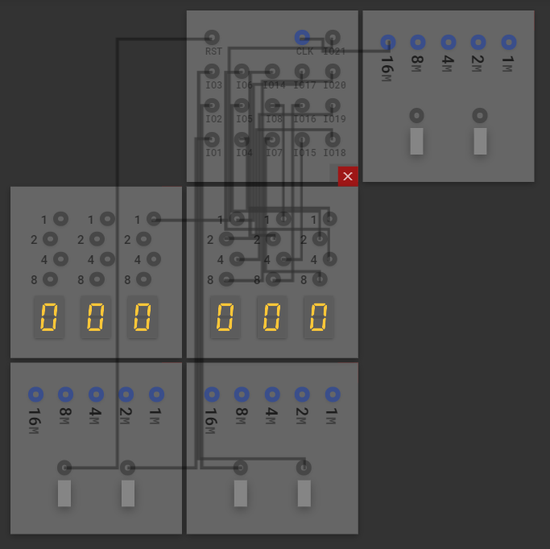
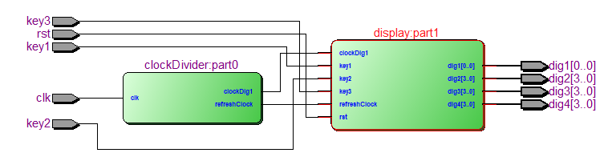
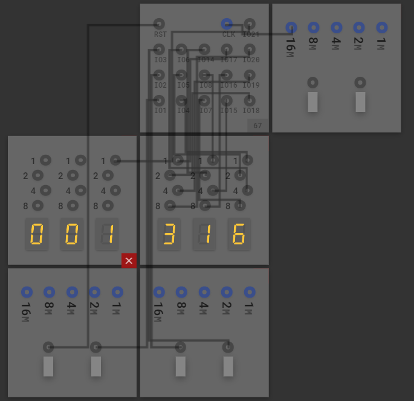

# **开放性数电实验设计报告**

## **实验目的**

1. Design and construct our own FPGA logic circuit
2. Become familiar with Quartus Software II and JieLabs FPGA simulation Software

## **实验材料**

I used JieLabs FPGA simulation software along with Quartus II for testing. The set-up is shown below. 



 
## **实验原理**

During the planning phase of this experiment, considering the limitations of JieLabs online (limited number of pins that can be used, which is 18) I designed a stopwatch with the following capabilties: 

1. measure time from 00:00 to 19:99 (seconds:centiseconds)
2. reset
3. start/stop
4. split
5. split history (up to 3 times)

This design would utilize the 16MHz Clock, 4 buttons, and 4 Decoded Digit displays. The timer would only be able to reset when the stopwatch isn't running, and each the splits can only be recorded when the stopwatch is running. The split history can store up to 3 different times. 

## **实验步骤**

The design of the Stopwatch is split up into three parts:

1. Stopwatch.vhd: constructs the main inputs along with the main outputs of the stopwatch.
2. clockDivider.vhd: generates two clocks from the board's internal 16MHz clock
3. display.vhd: includes three proceeses that controls the button functions, anode/cathode display, and button clocks. 

The schematic design is shown below



## **实验代码**

Stopwatch.vhd

This file creates the main inputs and outputs, along with the two sub parts. The initial clock input "CLK" (which is the board's 16MHz clock) will be connected to the Clock Divider. The "Clock Divider" will then send the "refreshClock" and "ClockDig1" clocks to the "Display" sub part. 

``` 
entity Stopwatch is
    Port ( 
        clk :   in     STD_LOGIC; -- Control Clock
        rst :   in     STD_LOGIC; -- STOP/RESET
        key1:   in     STD_LOGIC; -- GO/PAUSE
        key2:   in     STD_LOGIC; -- LAP
        key3:   in     STD_LOGIC; -- DISPLAY LAP
        dig1:   out    STD_LOGIC_VECTOR (0 downto 0) := "0"; -- 10 Seconds
        dig2:   out    STD_LOGIC_VECTOR (3 downto 0) := "0000"; -- 1 Seconds
        dig3:   out    STD_LOGIC_VECTOR (3 downto 0) := "0000"; -- .1 Seconds
        dig4:   out    STD_LOGIC_VECTOR (3 downto 0) := "0000" -- .01 Seconds
    );
end Stopwatch;

architecture struct of Stopwatch is 
    component clockDivider port (
        clk:            in  STD_LOGIC;
        refreshClock:   out STD_LOGIC;
        clockDig1:      out STD_LOGIC
    );
    end component;
    signal refreshSig:  STD_LOGIC;
    signal dig1Sig:     STD_LOGIC;
    component display port (
        refreshClock:   in  STD_LOGIC;
        clockDig1:      in  STD_LOGIC;
        rst :   in     STD_LOGIC; -- STOP/RESET
        key1:   in     STD_LOGIC; -- GO/PAUSE
        key2:   in     STD_LOGIC; -- LAP
        key3:   in     STD_LOGIC; -- DISPLAY LAP
        dig1:   out    STD_LOGIC_VECTOR (0 downto 0); -- 10 Seconds
        dig2:   out    STD_LOGIC_VECTOR (3 downto 0); -- 1 Seconds
        dig3:   out    STD_LOGIC_VECTOR (3 downto 0); -- .1 Seconds
        dig4:   out    STD_LOGIC_VECTOR (3 downto 0) -- .01 Seconds
    );
    end component;
    begin
        part0: clockDivider port map (
            clk             => clk,
            refreshClock    => refreshSig,
            clockDig1       => dig1Sig
        );
        part1: display port map (
            refreshClock    => refreshSig,
            clockDig1       => dig1Sig,
            rst             => rst,
            key1            => key1,
            key2            => key2,
            key3            => key3,
            dig1            => dig1,
            dig2            => dig2,
            dig3            => dig3,
            dig4            => dig4
        );    
end struct;

```

clockDivider.vhd

The stopwatch is broken down into two sub parts.  This subpart takes the 16MHz clock and creates two smaller 240Hz ("refreshClock") and 100Hz ("ClockDig1") clocks. Those two clocks are then used by the "Display" sub part. In order to calculate the right "counts" for each of the two clocks, we had to do some math. Since 16 MHz represents 16_000_000, we divide that by the Hz of the clocks that we are trying to make, and then by 2. Thus, 16_000_000/100/2 = 80_000 and 16_000_000/240/2 = 33_333. 

```
    library IEEE;
    use IEEE.STD_LOGIC_1164.ALL;
    use IEEE.NUMERIC_STD.ALL;

    entity clockDivider is
        port (
        clk:            in  STD_LOGIC;
        refreshClock:   out STD_LOGIC;
        clockDig1:      out STD_LOGIC
        );
    end clockDivider;

    architecture struct of clockDivider is 
        signal count1: integer range 0 to 50000000;
        signal count2: integer range 0 to 50000000;
        signal temp1:   STD_LOGIC:='0';
        signal temp2:   STD_LOGIC:='0';
    begin 
        frequencyDivider: process(clk)
        begin
        if rising_edge(clk) then
            count1 <= count1+1;
            count2 <= count2+1;
                if(count1 = 33333) then
                    temp1 <= NOT temp1;
                    count1 <= 0;
                end if;
                if(count2 =  80000) then
                    temp2 <= NOT temp2;
                    count2 <= 0;
                end if;
        end if;
        end process;
        refreshClock <= temp1;
        clockDig1 <= temp2;
    end struct;
```

display.vhd

This sub part contains most of our functions in the circuit. This file is includes three process blocks : button functions, anode/cathode display, and button clocks.

Button Functions: This process block dictates what happens when a certain button or combination of buttons are pushed. It also sets the numbers that will be displayed on the seven segment display by using the "ClockDig1" clock. In order to keep track of all the numbers, I used many signals and arrays to store the values for later use.

Docoded Number Displays: This process block sets the display. When the block receives the numbers to be used from the Button Functions block, it will then display them on their respective displays. The "refereshClock" helps display the centiseconds. 

Button Clocks: Using "ClockDig1," this process block detects edges for buttons key3 (Display Lap), key2 (Save Lap), and key1 (Start/Stop). The program is able to detect when a button is pushed and then save it to a signal where it is utilized in the previous process blocks.

The code is provied below. I shortened the code for the  "CONTROL CLOCK DISPLAY" portion as it simply outputs the number the the 4 displays, dig1, dig2, dig3, dig4.

```
library IEEE;
use IEEE.STD_LOGIC_1164.ALL;
use IEEE.NUMERIC_STD.ALL;

entity display is
    port (
        refreshClock:   in  STD_LOGIC;
        clockDig1:      in  STD_LOGIC;
        rst :   in     STD_LOGIC; -- STOP/RESET
        key1:   in     STD_LOGIC; -- GO/PAUSE
        key2:   in     STD_LOGIC; -- LAP
        key3:   in     STD_LOGIC; -- DISPLAY LAP
        dig1:   out    STD_LOGIC_VECTOR (0 downto 0); -- 10 Seconds
        dig2:   out    STD_LOGIC_VECTOR (3 downto 0); -- 1 Seconds
        dig3:   out    STD_LOGIC_VECTOR (3 downto 0); -- .1 Seconds
        dig4:   out    STD_LOGIC_VECTOR (3 downto 0) -- .01 Seconds
    );
end display;

architecture struct of display is 
    signal en: STD_LOGIC := '0';
    signal lap: STD_LOGIC := '0';
    signal displayer: STD_LOGIC := '0';
    signal push_button_sig_start : integer:=0;
    signal push_button_sig_save_lap: integer:=0;
    signal push_button_sig1 : integer:=0;
    signal push_button_sig2 : integer:=0;
    signal push_button_sig_display_lap : integer:=0;
    signal push_button_sig3 : integer:=0;
    signal lap_count : integer:=0;
    signal lap_display: integer:=0;

    -- Track Each dig#Count (0 smallest)
	subtype digitCount is integer range 0 to 9;
	type clocks is array (3 downto 0) of digitCount; 
	-- Track Each use#
	subtype usenum is integer range 0 to 9;
	type used is array (3 downto 0) of usenum;
	-- Track is dig#Lap#
	subtype digLap is integer range 0 to 9;
	type split is array (11 downto 0) of digLap;
	-- create arrays
	signal uses   : used := (0, 0, 0, 0);
	signal clock  : clocks := (0, 0, 0, 0);
	signal laps   : split := (0, 0, 0, 0, 0, 0, 0, 0, 0, 0, 0, 0);

    begin 
        -- CONTROL CLOCK BUTTONS -- 
        display: process (refreshClock, clockDig1, rst, key1, key2, key3, en, lap
        ,displayer, lap_count, lap_display, uses, clock, laps) is
        begin 
        -- RESET BUTTON -- 
        if (rst = '1' and en = '0') then
            for k in 0 to uses'length-1 loop
                uses(k)     <= 0;
                clock(k)    <= 0;
            end loop;
            for k in 0 to laps'length-1 loop
                laps(k)     <= 0;
            end loop;
        -- SHOW SPLIT TIMES --
        elsif (displayer = '1' and en = '0') then
            if (lap_display = 1) then 
                for k in 0 to uses'length-1 loop
                    uses(k) <= laps(k);
                end loop;
            elsif (lap_display = 2) then
                for k in 0 to uses'length-1 loop
                    uses(k) <= laps(k+4);
                end loop;
            elsif (lap_display = 3) then 
                for k in 0 to uses'length-1 loop
                    uses(k) <= laps(k+8);
                end loop;
            end if;
        -- COUNTING --
        elsif rising_edge(clockDig1) then
            if(en = '1') then
                for k in 0 to uses'length-1 loop
                    uses(k) <= clock(k);
                end loop;
                if (lap = '1') then 
                    if (lap_count = 1) then 
                        for k in 0 to clock'length-1 loop
                            laps(k) <= clock(k);
                        end loop;
                    elsif (lap_count = 2) then
                        for k in 0 to clock'length-1 loop
                            laps(k+4) <= clock(k);
                        end loop;
                    elsif (lap_count = 3) then
                        for k in 0 to clock'length-1 loop
                            laps(k+8) <= clock(k);
                        end loop;
                    end if;
                end if;            
                -- Centiseconds < Seconds
                clock(0) <= clock(0) + 1;
                if(clock(0) = 9)  then
                    clock(0) <= 0;
                    clock(1) <= clock(1) + 1;
                    if (clock(1) = 9) then
                        clock(1) <= 0;
                        clock(2) <= clock(2) + 1;
                        if (clock(2) = 9) then 
                            clock(2) <= 0 ;
                            clock(3) <= clock(3) + 1;
                            if (clock(3) = 1)  then
                                clock(3) <= 0;
                            end if;
                        end if;
                    end if;
                end if;
            end if;
        end if; 
        end process display;

      -- CONTROL CLOCK DISPLAY --
        process(refreshClock)
        variable digit: unsigned (1 downto 0) := "00";
        begin
            if (rising_edge(refreshClock)) then
                case digit is 
                    when "00" => -- 00.01
                    when "01" => -- 00.10
                    when "10" => -- 01.00
                    when "11" =>    10.00
                    when others =>
                end case;
                digit := digit + 1;
            end if;
        end process;   

        - CONTROL BUTTONS --
        process(clockDig1)
        begin
            if (rising_edge(clockDig1)) then 
                if(key3 = '1') then
                    push_button_sig_display_lap <= 1;
                elsif (key3 = '0') then
                    push_button_sig_display_lap <= 0;
                end if;
                push_button_sig3 <= push_button_sig_display_lap;
                if (push_button_sig3 = 0 and push_button_sig_display_lap = 1) then
                    displayer <= '1';
                    lap_display <= lap_display + 1;
                    if (lap_display = 3) then
                        lap_display <= 1;
                    end if;
                elsif (push_button_sig3 = 1 and push_button_sig_display_lap = 0) then
                        displayer <= '0';
                end if;

                if (key2 = '1') then
                    push_button_sig_save_lap <= 1;
                elsif(key2 = '0') then
                    push_button_sig_save_lap <= 0;
                end if;
                push_button_sig2 <= push_button_sig_save_lap;
                if (push_button_sig2 = 0 and push_button_sig_save_lap = 1) then
                    lap <= '1';
                    lap_count <= lap_count + 1;
                    if (lap_count = 3) then
                        lap_count <= 1;
                    end if;
                elsif (push_button_sig2 = 1 and push_button_sig_save_lap = 0) then
                    lap <= '0';
                end if;
                if (key1 = '1') then 
                    push_button_sig_start <= 1;
                elsif (key1 = '0') then 
                    push_button_sig_start <= 0;
                    
                end if;
                push_button_sig1 <= push_button_sig_start;
                if (push_button_sig1 = 0 and push_button_sig_start = 1) then
                    en <= not en;
                    lap_display <= 0;
                end if;
                if (rst = '1' and en = '0') then
                    lap_count <= 0;
                    lap_display <= 0;
                end if;
            end if;
        end process; 
end struct;
```

## **实验结论**



The functions of the buttons are

1. furthest left - reset
2. second to left - go/stop
3. third to left - split time
4. most right - show history
 

Based on the results, I feel that this experiment went quite well. However, due to the limitations of the virtual FPGA board on the JieLabs platform, the stopwatch I have created has limited functionality, and I wasn't completely satisfied. For example, it can only count to 19:99 seconds before reaching its limit. However, since I had my own FPGA board, the Altera Cylone IV EP4CE6F17C8N FPGA Board by Alinx, I did a little more testing to create a more realistic stopwatch and become more familiar with a physical FPGA board. The board is shown below. 


This board can support up to six 8-segmented displays (7 for the number and 1 for the decimal point) and have 4 buttons. Although the general structure of the design is completely the same, there are a few differences between the JieLabs board and CycloneIV. 

1. Since there are more pin slots availible on the Cyclone IV board, I could add more functionality. First, the timer could count up to 59:59:99 (minutes:seconds:centiseconds). Secondly, I added LED lights to show which "state" it was on. 
2. Instead of a 16MHz clock, the CycloneIV's internal clock was 50 MHz. 

Through this experiment, I became more familiar with the CLOCK aspect of a FPGA board and digital circuit. I also learned how to utilize type and subtype to create arrays that can store integers. I really enjoyed all the projects from this lab class, thank teachers and teacher assistants. 

